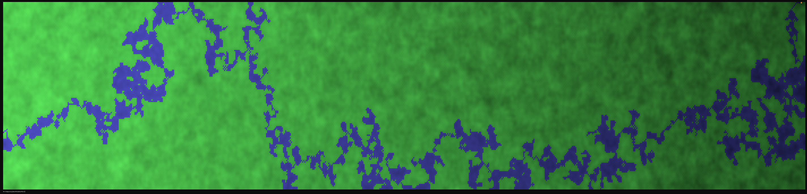
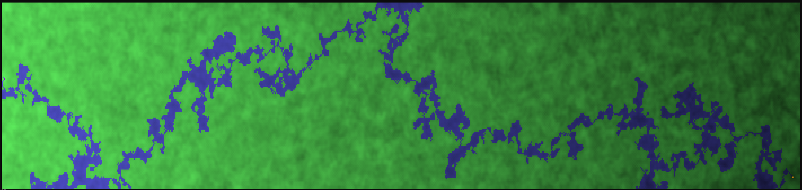
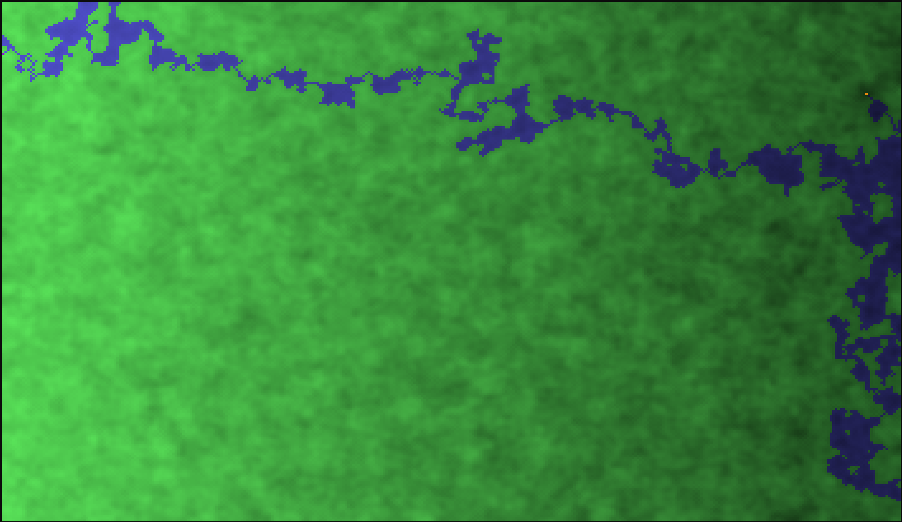

# WaterFlow
Simulated water flowing down a terrain

At each step, the water finds the lowest square beside the water to flood.
Notice that this makes the water able to fill lakes.
If the heights are

5554555

5543455

5432345

5543455

5553555

and water starts from the 4 at the top, the water will go lower until it has nowhere to go.

555W555

554W455

543W345

5543455

5553555

Then, water will go to the 3's.

555W555

554W455

54WWW45

554W455

5553555

Then it can exit!

555W555

554W455

54WWW45

554W455

555W555

Notice that there is now a small lake!
This is how my algorithm works. The water flows down a slope from the highest point to the other side of the slope.
It runs in Windows Terminal/PowerShell using ANSI escape codes to do colors and cursor movement.

Pictures if you can't run it:

Long picture:

Another one:

One in fullscreen:

